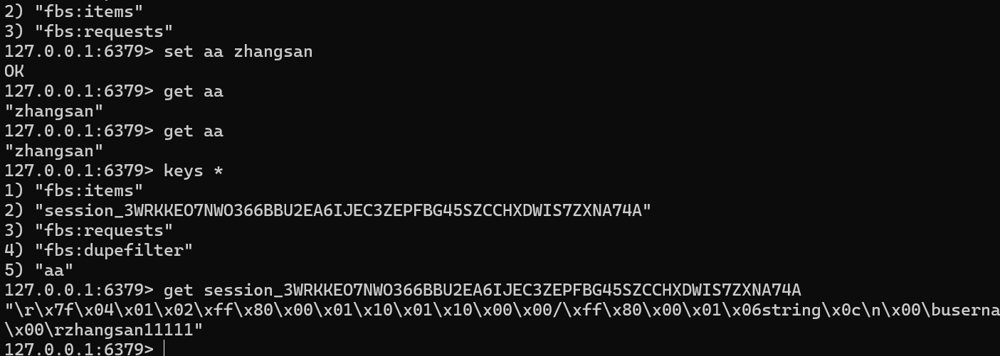

# gin
    go get -u github.com/gin-gonic/gin
## session
    session是一种记录客户状态的机制，不同的是cooki保存到客户端浏览器中，而session保存在服务器上
    第三方 https://github.com/gin-contrib/sessions
    下载 go get github.com/gin-contrib/sessions

# redis
    go get -u github.com/gin-contrib/sessions/redis
    路径：D:\Redis-x64-3.0.504
    先打开：redis-server.exe
    再打开：redis-cli.exe
    看session
    

# GROM https://gorm.io/zh_CN/docs/index.html
        go get -u gorm.io/gorm
        go get -u gorm.io/driver/mysql
